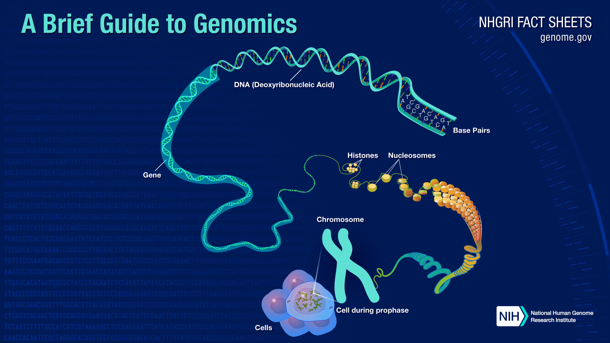

# Gene_Causal_Mapper

Welcome to Gene_Causal_Mapper (gcmap)!

This repo will soon contain software 
called Gene_Causal_Mapper (or gcmap for short) 
for
discovering a causal DAG for genes via
the Mappa Mundi (MM) algorithm.
The software applies the MM algorithm 
to finding what
are called Gene Regulatory Networks (GRN),
Autoregulon  Nets
and Network Motifs 
in the Genomics and Systems Biology literature.

I discuss the gcmap algorithm 
in this white paper:
* Version 1.0 (March 16, 2025) Superceded by Version 1.1
* [Version 1.1](https://github.com/rrtucci/gene_causal_mapper/blob/master/white-paper/gene-causal-mapper1.pdf)  

 April 27, 2025