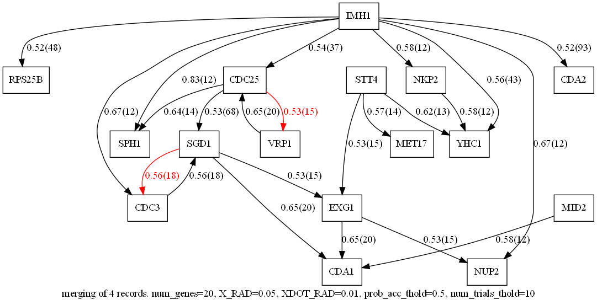

# Gene_Causal_Mapper

Welcome to Gene_Causal_Mapper (gcmap)!

Gene_Causal_Mapper (or gcmap for short) 
is a python program for
discovering a causal Dag for genes via
the Mappa Mundi (MM) algorithm.

The software applies the MM algorithm 
to finding what
are called Gene Regulatory Networks (GRN),
Autoregulon  Nets
and Network Motifs 
in the Genomics and Systems Biology literature.

As an example, we apply it to the DREAM3 
dataset for yeast.

I discuss the gcmap algorithm 
in this white paper:
* Version 1.0 (March 16, 2025) Superceded by Version 1.1
* Version 1.1 (April 7, 2025) Added new figure and made some minor corrections.
* [Version 1.2](https://github.com/rrtucci/gene_causal_mapper/blob/master/white-paper/gene-causal-mapper1.pdf) (April 26, 2025)
Added Ref to this github repo and to DREAM3
